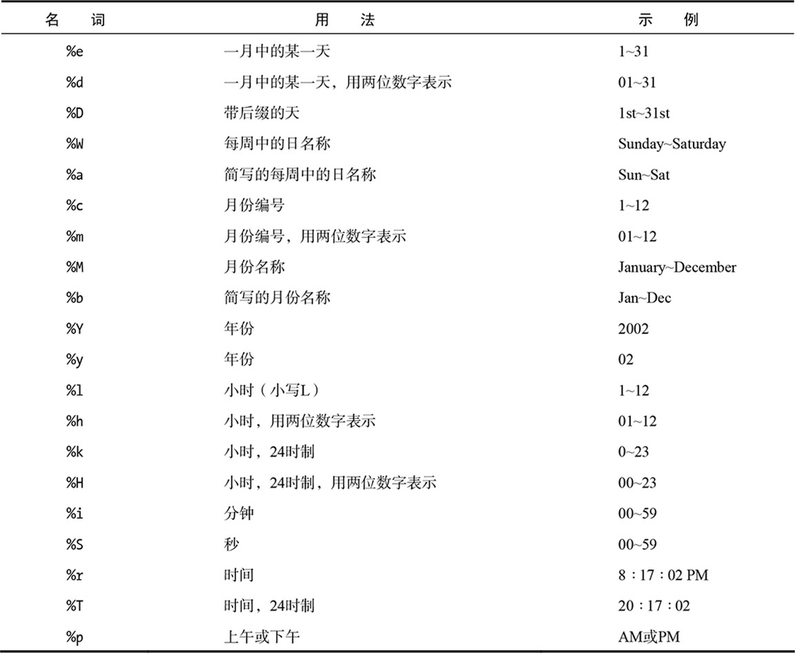

创建数据库和表：
```
CREATE DATABASE databasename

CREATE TABLE tablename (
column1name description,
column1name description
)
```

创建user表：

```
CREATE TABLE users (
user_id MEDIUMINT UNSIGNED NOT NULL AUTO_INCREMENT,
first_name VARCHAR(20) NOT NULL,
last_name VARCHAR(40) NOT NULL,
email VARCHAR(60) NOT NULL,
pass CHAR(40) NOT NULL,
registration_date DATETIME NOT NULL,
PRIMARY KEY (user_id)
);
```

确认表是否存在：

```
SHOW TABLES;
SHOW COLUMNS FROM users; // 查看user表的结构
```
### 插入记录

用insert命令来插入记录：
```
INSERT INTO tablename (column1, column2...)
VALUES (value1, value2...)
INSERT INTO tablename (column4, column8)
VALUES (valueX, valueY)
```
注意，任何未赋值的列都将被视为NULL(如果定义了默认值，就设置为默认值)

第二种方式：
```
INSERT INTO tablename VALUES (value1, NULL, value2, value3, ...)
```

MySQL还允许同时插入多行，并用逗号隔开每条记录。
```
INSERT INTO tablename (column1, column4) VALUES (valueA, valueB),
(valueC, valueD),
(valueE, valueF)
```

在每个SQL命令中：

- 数值不应该用引号括住;
- 字符串值(对于CHAR、VARCHAR和TEXT列类型)必须总是用引号括住;
- 日期和时间值必须总是用引号括住;
- 函数不能用引号括住;
- 单词NULL一定不能用引号括住;

如果在值中使用引号，必须转义：
```
INSERT INTO tablename (last_name) VALUES ('O\'Toole')
```

向users表中插入一条记录(指定列的方式)：
```
INSERT INTO users 
(first_name, last_name, email, pass, registration_data)
VALUES('Larry', 'Ullman', 'email@example.com',
SHA1('mypass'), NOW());
```

SHA1()是MySQL函数，用来加密密码，NOW()函数用来插入当前系统日期和时间。

SHA1()加密后的字符串长度为40个字符。这也是为什么把pass列设为CHAR(40)的原因。

SHA1()是单向加密技术，对于那些无需以未加密的形式再次查看的敏感数据

如果使用MD5()函数，可以把pass列定义为CHAR(32)。

不指定列向表中插入数据：
```
INSERT INTO users VALUES
(NULL, 'Zoe', 'Isabella', 'email2@example.com',
SHA1('mojito'), NOW());
```
这种方法必须为每个字段提供一个值，将user_id设置为NULL值，依据其AUTO_INCREMENT
描述，它将导致MySQL使用下一个逻辑编号。

你偶尔会在SQL命令中看到使用反引号(`)。它被用来安全地引用可能与已存在的MySQL关键词重复的表名或列名。

如果MySQL对你的上一条查询发出警告，使用SHOW WARNINGS命令可以显示问题

INSERT中一个有意思的变化是REPLACE，如果使用的表的主键或唯一索引的值已经存在，那么REPLACE会更新存在的行。如果不存在则会同INSERT一样插入新行。

### 选择数据

查询语句：
```
SELECT wich_columns FROM which_table

SELECT column1, column3 FROM tablename
```
1. 明确选择哪些列对性能有好处。
2. 顺序，可以用一种不同于它们在表中布局的顺序返回列。

查询当前日期时间：
```
SELECT NOW();
```

### 使用条件语句

```
SELECT which_columns FROM which_table WHERE condition(s)
```
mysql 运算符

|mysql运算符|含义|
|----|----|
|!=(或<>)|不等于|
|IS NOT NULL|具有一个值|
|IS NULL|没有值|
|IS TRUE|有一个真值|
|IS FALSE|有一个假值|
|BETWEEN|在范围内|
|NOT BETWEEN|在范围外|
|IN|在值列表中找到|
|NOT IN|未在值列表中找到|
|OR(or ||)|两个语句之一为真|
|AND(or &&)|两个语句都为真|
|NOT|条件语句不为真|
|XOR|两个条件语句只有一个为真|

### 使用条件语句

选择姓氏为Simpson的所有用户：
```
SELECT * FROM users
WHERE last_name = 'Simpson';
```
查询某个范围内的数据：
```
SELECT * FROM cities WHERE
zip_code IN(90210, 90211)
```

查询user表中没有电子邮件地址的每一条记录的每一列：
```
SELECT * FROM users
WHERE email IS NULL;
```

```
SELECT * FROM users WHERE email=''; // 将匹配email字段为NULL的情况
```

选择其中的密码为mypass的所有记录

```
SELECT user_id, first_name, last_name
FROM users
WHERE pass = SHA1('mypass');
```
选择其用户ID小于10或大于20的用户名
```
SELECT first_name, last_name
FROM users WHERE
(user_id < 10) OR (user_id > 20);

===============================

// 这个查询也可以写为：
SELECT first_name, last_name
FROM users WHERE user_id
NOT BETWEEN 10 and 20
```
MySQL支持关键字TRUE和FALSE，不区分大小写。在内部，TRUE等于1而FALSE等于0。因此，TRUE+TRUE=2。

### 使用LIKE和NOT LIKE
常常与两个通配置符一起使用：下划线(_)，用于匹配单个字符;百分号(%)，用于匹配0个或多个字符。

带有Like条件语句的查询一般比较慢，因为它们不能利用索引，所以仅当绝对需要时才使用这种格式。

LIKE和NOT LIKE 也可以用于数字列。

可以添加任意个下滑线，表示添加任意多个字。

### 排序查询结果

```
SELECT * FROM tablename ORDER BY column
SELECT * FROM orders ORDER BY total
```
使用ORDER BY时的默认顺序是升序(ASC)，这意味着数字将从小到大递增，而日期将从过去到最近排列，文本则按照字母顺序排列。

指定降序来排列：
```
SELECT * FROM tablename
ORDER BY column DESC
```

按多个列对返回的值进行排序：
```
SELECT * FROM tablename
ORDER BY column1, column2
```

ORDER BY与WHERE的结合使用，前者放到后者的后面。
```
SELECT * FROM tablename WHERE conditions
ORDER BY column
```

按姓氏以字母顺序选择所有用户
```
SELECT first_name, last_name FROM
users ORDER BY last_name;
```

按注册的日期显示所有不是Simpson的用户。
```
SELECT * FROM users
WHERE last_name != 'Simpson'
ORDER BY registration_data DESC;
```

可以在任何列类型（包括数字和日期）上使用ORDER BY。也可以在带有条件语句的查询中使用这个句子，并且吧ORDER BY放在WHERE之后。

如果要排序的列是ENUM类型，排序会基于列创建时的ENUM值的顺序。例如，如果有一个gender列，定义为`ENUM('M','F')`，子句ORDER BY gender返回的结果是M记录在前。

### 限制查询结果

可以添加到查询语句中的另一个SQL子句是LIMIT。

在SELECT查询中，WHERE指示返回哪些记录，ORDER BY决定如何对这些记录进行排序，LIMIT用于返回多少条记录。

用法：
```
SELECT * FROM tablename LIMIT 3 // 返回3条记录
SELECT * FROM tablename LIMIT x, y //返回从x开始的n条记录
```

返回第11~20条记录
```
SELECT * FROM tablename LIMIT 10, 10 // 从0开始数，10就代表第11条记录
```

可以与WHERE和/或ORDER BY一起使用LIMIT，总是将LIMIT放在查询的末尾。
```
SELECT which_columns FROM tablename WHERE 
conditions ORDER BY column LIMIT x
```

在显示多页查询结果时(在多个页面成块显示它们)，常常使用LIMIT x, y子句。

LIMIT字句不会改进查询的速度。

LIMIT名词不是SQL标准的一部分。

LIMIT不仅仅可以与SELECT一起使用，还可以与大多数类型的查询一起使用。

### 更新数据

语法：
```
UPDATE tablename SET column=value

// 可以一次改变一条记录中多列的内容，用逗号隔开
UPDATE tablname SET column1=valueA, 
column5=valueB...
```

通常用WHERE子句来指定要更新哪些行。
```
UPDATE tablename SET column2=value 
WHERE column5=value
```

>更新以及删除是使用主键最主要的原因。

```
SELECT user_id FROM users
WHERE first_name = 'Michael'
AND last_name = 'Chabon';
```

更新记录：
```
UPDATE users
SET email='mike@authors.com'
WHERE user_id = 18;
```
**提示：**

1. 无论何时使用UPDATE，都要使用WHERE条件语句。
2. 防止意外更新过多的行，可以对UPDATE应用一个LIMIT子句。
3. 不应该更新的主键的值。

### 删除数据

语法：
```
DELETE FROM tablename //一旦删除将不会恢复
DELETE FROM tablename WHERE condition
```

删除user_id为8的记录：
```
DELETE FROM users
WHERE user_id = 8 LIMIT 1;
```

**提示：**

清空一个表首选TRUNCATE：
```
TRUNCATE TABLE tablename
```

要删除表中的所有数据以及表本身，可以使用DROP TABLE：
```
DROP TABLE tablename
```

要删除整个数据库(包括其中的每一个表及其所有数据)，可以使用：
```
DROP DATABASE databasename
```

### 使用函数

对列的某个值应用某个函数：
```
SELECT FUNCTION(column) FROM tablename
```

要对一个列的值应用某个函数，同时还选择其他一些列：
```
SELECT *, FUNCTION(column) FROM tablename
SELECT column1, FUNCTION(column2),column3 FROM tablename
```

函数既可以应用于存储的数据（即列），也可以应用于字面量值。

**别名**

别名(alias)只是查询中对表或列进行的符号性重命名。别名通常应用于表、列或函数调用，它提供了引用某个对象的快捷方式。使用AS名词来创建别名：
```
SELECT registration_date AS reg FROM users
```

如果在表或列上定义了一个别名，那么整个查询必须一致地使用那个相同的别名，而不用原来的名称：
```
SELECT first_name AS name FROM users WHERE name='Sam' 
// 这有别于标准的SQL，标准的SQL不支持在WHERE条件语句中使用别名。
```

别名是区分大小写的字符串，由数字、字母和下划线组成。

### 文本函数

|函数|用法|用途|
|----|----|----|
|CONCAT()|CONCAT(t1, t2, ...)|创建形如t1t2的新字符串|
|CONCAT()|CONCAT_WS(S, t1, t2, ...)|创建形如t1St2S的新字符串|
|LENGTH()|LENGTH(t)|返回t中的字符数|
|LEFT()|LEFT(t, y)|从t中返回最左边的y个字符|
|RIGHT()|RIGHT(t, x)|从t中返回最右边的x个字符|
|TRIM()|TRIM(t)|从t的开头和末尾删除多余的空格|
|UPPER()|UPPER(t)|大写t中的所有字符|
|LOWER()|LOWER(t)|小写t中的所有字符|
|REPLACE()|REPLACE(t1, t2, t3)|把t1字符串中的t2替换成t3|
|SUBSTRING()|SUBSTRING(t, x, y)|从t中返回开始于x的y个字符(索引从1开始)|

CONCAT()用于执行连接，PHP中使用句点`.`
```
SELECT CONCAT(t1, t2) FROM tablename
```

比如将姓名合并：
```
SELECT CONCAT(first_name, ' ', last_name) FROM users
```

由于连接通常会返回列的新形式，所以推荐使用别名:
```
SELECT CONCAT(first_name, ' ', last_name) AS Name FROM users
```
在查询语句后面任何需要用到别名所对应的那列的数据的函数都可以使用此别名。

找出最长的姓氏：
```
SElECT LENGTH(last_name) AS L,
last_name FROM users
ORDER BY L DESC LIMIT 1;
```

MySQL具有两个用于对文本执行正则表达式查找的函数：`REGEXP()` 和 `NOT REGEXP()`

CONCAT()具有一个名为CONCAT_WS()的派生函数，它代表带分隔符。语法是：
```
CONCAT_WS(separator, t1, t2)
```

例子，将人名格式化为：
```
First<SPACE>Middle<SPACE>Last

// 可以写为：
SELECT CONCAT_WS(' ', first, middle, last) AS Name FROM tablename
```

CONCAT_WS会忽略具有NULL值的列。

### 数字函数
|函数|用法|用途|
|----|----|----|
|ABS()|ABS(n)|返回n的绝对值|
|CEILING()|CEILING(n)|基于n的值返回下一个最大的整数|
|FLOOR()|FLOOR(n)|返回n的整数值|
|FORMAT()|FORMAT(n1, n2)|返回格式化一个数的n1，这个数带有n2位小数，并且每3位之间插入一个逗号|
|MOD()|MOD(n1, n2)|返回n1除以n2的余数|
|POW()|POW(n1, n2)|n2是n1的幂|
|RAND()|RAND()|返回0~1.0之间的一个随机数|
|ROUND()|ROUND(n1, n2)|返回数n1，它被四舍五入为n2位小数|
|SQRT()|SQRT(n)|计算n的平方根|

例子：

```
FORMAT(car_cost, 2) //将把数字转换为`20,198.20`
```

ROUND()将获取一个值，比如来自某一列，将其四舍五入为一个指定小数位的数字。
如果没有指定小数位，就会将其四舍五入为最接近的整数。

RAND()函数可以与查询一起用于随即顺序返回结果：
```
SELECT * FROM tablename ORDER BY RAND()
```

显示一个被格式化为美元金额的数字
```
SELECT CONCAT('$', FORMAT(5639.6, 2))
AS cost;
```

从表中随机获取一个电子邮件地址：
```
SELECT email FROM users
ORDER BY RAND() LIMIT 1;
```

MOD()函数等同于使用百分号：
```
SELECT MOD(9, 2)
SELECT 9%2
```

### 日期和时间函数

|函数|用法|用途|
|----|----|----|
|DATE()|DATE(dt)|返回dt的日期值|
|HOUR()|HOUR(dt)|返回dt的小时值|
|MINUTE()|MINUTE(dt)|返回dt的分钟值|
|SECOND()|SECOND(dt)|返回dt的秒值|
|DAYNAME()|DAYNAME(dt)|返回dt中天的名称|
|DAYOFMONTH()|DAYOFMONTH(dt)|返回dt中天的数字值|
|MONTHNAME()|MONTHNAME(dt)|返回dt中月份的名称|
|MONTH()|MONTH(dt)|返回dt中月份的数字值|
|YEAR()|YEAR(column)|返回dt中年份的数字值|
|CURDATE()|CURDATE()|返回当前日期|
|CURTIME()|CURTIME()|返回当前时间|
|NOW()|NOW()|返回当前日期和时间|
|UNIX_TIMESTAMP()|UNIX_TIMESTAMP(dt)|返回从新纪元起直到当前时刻或者直到指定日期的秒数|
|UTC_TIMESTAMP()|UTC_TIMESTAMP(dt)|返回从新纪元起直到当前时刻或直到指定日期的秒数(UTC时间)|

显示上一个用户注册的日期：
```
SELECT DATE(registration_date) AS
Date FROM users ORDER BY 
registration_date DESC LIMIT 1;
```

返回第一个注册用户的一周中的某一天：
```
SELECT DAYNAME(registration_date) AS
Weekday FROM users ORDER BY
registration_date ASC LIMIT 1;
```

返回MySQL服务器上的当前日期和时间：
```
SELECT CURDATE(), CURTIME();
```

显示当前月份的最后一天：
```
SELECT LAST_DAY(CURDATE()),
MONTHNAME(CURDATE());
```

下列几个函数可以计算日期和时间：
```
ADDDATE()
SUBDATE()
ADDTIME()
SUBTIME()
```

### 格式化日期和时间
两个函数：
```
DATE_FORMAT()
TIME_FORMAT()
```

如果一个值同时包含日期和时间，那么DATE_FORMAT()可以用于格式化它们。

TIME_FORMAT()只能格式化时间值，并且仅当存储时间值(HH:MM:SS)时才可以使用它。

语法：
```
SELECT DATE_FORMAT(datetime, formatting)
```

格式化参数表：


