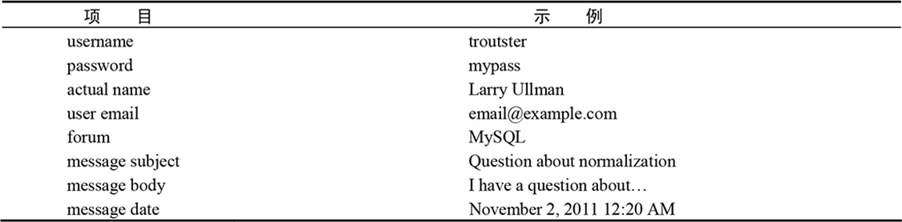
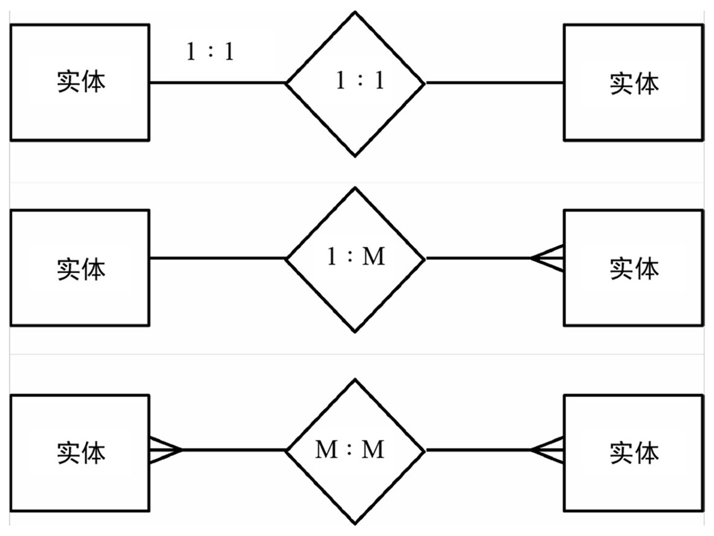

### 规范化
确立数据库的结构

确保数据库的可行性，可用性和可靠性。

范式用于帮助定义数据组织形式。

在开始规范化数据库之前，你必须定义要开发的应用程序的作用。

比如：我想创建一个用户可以发帖和其他用户可以回帖的留言板。用户需要注册，然后使用电子邮箱/密码的组合登陆以发布信息。

**提示：**

- 确定在数据库中存储什么信息的最好的方法是，仔细考虑一下将向数据库询问的问题，以及答案中会包含哪些数据。
- 存储的内容尽可能多余你可能需要的。
- 如果只关注细节，规范化会非常难以学习。

### 键
分为主键和外键。

主键是唯一的标识符，规则：

- 始终有一个值(不能为NULL)
- 具有一个保持不变的值(永不改变)
- 表中的每一条记录都有唯一的值

第二种是外键，外键是表A的主键在表B中的代表。

一个简单的论坛数据库：


如果在表中找不到主键就创建一个。如果这个主键没有任何其他意义和目的，就称其为代理主键。

一般来说，使用表名的一部分(例如，message)和id这个此来命名主键。

MySQL只允许每个表有一个主键，虽然你可以让主键基于多列。

理想情况下，主键应该是整数，使MySQL的性能更佳。

### 关系
1. 一对一
2. 一对多
3. 多对多

数据的库的两个表也可能没有任何关系。

如果A表中有且仅有一条的记录对应表B的唯一一条记录，那这种关系称为一对一的关系。

如果表A中的一条记录对应表B中的多条记录，那这种关系称为一对多关系。

两个表之间的一个多对多关系最好使用中间表，表示成两个一对多关系。

应该避免多对多关系，因为它们会带来数据冗余和完整性问题。

**提示：**

数据库设计过程的结果就是ERD(实体-关系图)或ERM(实体-关系模型)。图像化的数据库表示方法使用图形来表示表和列。

下图是一个关系图：


### 第一范式

定义：符合1NF的关系中的每个属性都不可再分。

要满足第一范式(1NF)，数据库中的每一个表必须具有一下两个性质：

- 每一列必须仅包含一个值(有时候这被描述为原子性或不可分隔性);
- 所有表都不能具有相关数据的重复列。

任何非原子性的列都应该被打散成多列。如果一个表有重复的相似列，就把这些列转化为只包含这些列的单独表。

另外一个问题是，一个表是否使用了一列存储多个电话号码(移动电话，家庭电话，工作电话)，或用一列存储一个人的兴趣爱好(烹饪，跳舞，滑雪等等)。

应该尽量避免NULL值出现在数据库中。

每个表都要有一个主键是第一范式中隐含的思想。

**提示:**

理解第一范式最简单的方法是，它就是横向分析表的规则：检查单独一行的所有列，确保唯一性并避免重复出现类似的数据。

### 第二范式

规则：

- 如果数据库要符合第二范式(2NF)，数据库首先必须符合第一范式(必须按顺序规范化)。
- 然后，表的每一个不为键(例如，外键)的列必须依赖主键。

当某一列在多行中具有相同的非键值时，通常可以确定它违反了这个规则。这些值应该存储在它们自己的表中，并且通过键关联回原来的表。

规范化其实可以理解为创建更多表的过程，直到所有潜在冗余都被消除为止。

测试第二范式的另外一种方法是查看表之间的关系。理想的情况下是创建一对一或一对多的情况。有多对多关系的表则需要重新组织。

经过恰当规范化的数据库永远不会有重复的行出现在同一个表中(两个或更多的行的所有非主键列相同)

为了简化规范化的过程，记住第一范式是一个横向检查表的问题，而第二范式是一个纵向的分析(搜索多行上重复的值)

### 第三范式
如果数据库符合第二范式，并且每个非键列互相之间是独立的，那它就符合第三范式(3NF)。

### 审查设计
如果有一个主键——外键链接(像forums表中的forum_id和消息中的forum_id)，这两列应该是相同类型(在此处为TINYINT UNSIGNED NOT NULL)。

### 创建索引
索引是一种数据库用于提高SELECT查询效率的特殊体制。索引可以放到一列或多列，可以设置为任何特殊数据类型，它能告诉MySQL要特别注意那些值。

MySQL至少能保证为每个表创建16个索引，每个索引可以是最多包含15列。虽然多列索引的需求可能不太明显，但它会在频繁搜索相同的列组合时派上用场(例如，名和姓、市和州等)。

虽然索引提高了数据库的读取速度，但却减慢了对更改数据的查询(因为这些更改数据需要记录在索引中)

索引适用于以下类型的列：

- 查询的WHERE部分中频繁使用的的列
- 在查询的ORDER BY部分中频繁使用的列
- 经常被用于JOIN连接点的列

通常，不应为下面这些列创建索引：

- 允许为空的列
- 字段值的范围很有限(例如仅仅是Y/N或1/0)

MySQL有4种类型的索引：

1. INDEX(标准索引)
2. UNIQUE(每一行对于索引列具有唯一的值)
3. FULLTEXT(用于执行FULLTEXT查找)
4. PRIMARY KEY(就是一个特殊的UNIQUE索引)

注意，一列只能有一个索引，因此要选择最合适的索引类型。

要在创建表时设立索引，就需要在CREATE TABLE命令中添加以下语句：
```
INDEX_TYPE index_name(columns)
```

索引名是可选的，如果没有提供名称，索引会使用它应用的列的名字。
当索引多列时，以逗号将它们分隔，并按照从最重要到最不重要的顺序排列：
```
INDEX full_name(last_name, first_name)
```

以下命令创建了一个user_id为主键索引的表：
```
CREATE TABLE users(
user_id MEDIUMINT UNSIGNED NOT NULL
AUTO_INCREMENT,
first_name VARCHAR(20) NOT NULL,
last_name VARCHAR(40) NOT NULL,
email VARCHAR(40) NOT NULL,
pass CHAR(40) NOT NULL,
registration_date DATETIME NOT NULL,
PRIMARY KEY(user_id)
);
```

